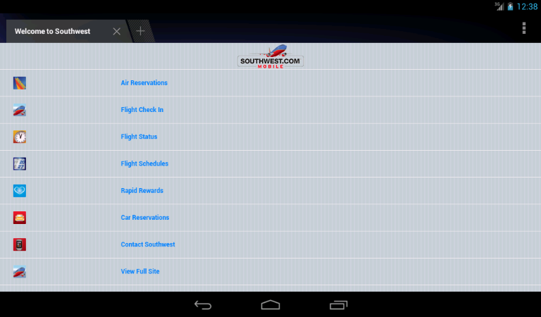

# Bootstrap


Sleek, intuitive, and powerful front-end framework for faster and easier web 
development.

>  <http://twitter.github.io/bootstrap/>
>  <https://github.com/twitter/bootstrap>

## Responsive Design

> **Mobile/Desktop Dichotomy**
>
> vs
>
> **Continuous range of functionality**

Responsive means using what is available on the device, and falling back
gracefully as needed.

Progressive Enhancement and Feature Detection

* Screen size and density
* Touch vs mouse input
* Browser capablities (storage, location services, camera)

### Mobile Sites

Old-school mobile sites are pretty underwhelming on modern hardware:


### Mobile Sites

And are especially awkward on tablets and intermediate-sized displays:



### Mobile Sites

And often provide a jarring, inconsistent experience compared to the desktop:


## What?

Originaly built by some folks at Twitter to reduce the repetitive work
projects were spending building internal apps and sites. Has taken on a life
of it's own since.

* Comprehensive UI toolkit to quickly create sites
* Clean, declarative syntax. Mostly CSS
* Designed to be tweaked and extended

## How?

Using it is pretty simple, just add the stylesheets and scripts you need:

```html.readonly
<head>
  <link rel="stylesheet" href="./css/bootstrap.css" />
  <!-- only needed if you want responsive functionality -->
  <link rel="stylesheet" href="./css/bootstrap-responsive.css" />
  <!-- include what you use here -->
  <script src="./js/bootstrap/bootstrap-dropdown.js"></script>
  <script src="./js/bootstrap/bootstrap-modal.js"></script>
  ...
```

## Basic Capabilities

Offers a lot of basic components to *bootstrap* an app and get you started
quickly:

* Grid layout
* Buttons, dropdowns, forms and other common widgets
* Navigation bars, tabs
* Modals
* And wait, there's more

### Grid Layout

Bootstrap provides a 12 column [grid layout][grid-reference] to position
content on the page.

```html.readonly
<div class="row">
  <div class="span1"></div>
  <div class="span1"></div>
  ...
</div>
<div class="row">
  <div class="span2"></div>
  ...
</div>
```

(this page is in an 8-column span, which is why the math below doesn't add to
12)

<div class="row show-grid">
  <div class="span1">span1</div>
  <div class="span1">span1</div>
  <div class="span1">span1</div>
  <div class="span1">span1</div>
  <div class="span1">span1</div>
  <div class="span1">span1</div>
  <div class="span1">span1</div>
  <div class="span1">span1</div>
</div>
<div class="row show-grid">
  <div class="span2">span2</div>
  <div class="span2">span2</div>
  <div class="span2">span2</div>
  <div class="span2">span2</div>
</div>
<div class="row show-grid">
  <div class="span3">span3</div>
  <div class="span5">span5</div>
</div>

### Buttons, Icons, etc.

The `.btn` class will turn pretty much anything into a
[button][button-reference]:

```html.interactive.onload
<button class="btn">Click Me</button>
<a class="btn">Another</a>
```

Lots of styles and variants are available using additional classes:

```html.interactive
<button class="btn btn-primary">Primary</button>
<button class="btn btn-danger btn-large">Large and Dangerous!</button>
```

### Buttons, Icons, etc.

And they can also be combined with [icons][icon-reference],
[dropdowns][dropdown-reference], etc.  to control how they are displayed and operate:

```html.interactive.onload
<div class="btn-group">
  <a class="btn"><i class="icon-play" /> Ready</a>
  <a class="btn"><i class="icon-fire" /> Fire</a>
  <a class="btn"><i class="icon-bullseye" /> Aim</a>
</div>
<div class="btn-group dropdown">
  <a class="btn dropdown-toggle" data-toggle="dropdown" href="#">
    Choose Your Poison
    <span class="caret"></span>
  </a>
  <ul class="dropdown-menu">
    <li><a href="#">Arsenic</a></li>
    <li><a href="#">Mustard Gas</a></li>
    <li><a href="#">Keystone Light</a></li>
  </ul>
</div>
```

### Forms

It includes tons of [built-in][forms-reference] support for both stacked and
inline forms:

```html.interactive
<form class="form-horizontal">
  <div class="control-group">
    <label class="control-label" for="inputEmail">Email</label>
    <div class="controls">
      <input type="text" id="inputEmail" placeholder="Email">
    </div>
  </div>
  <div class="control-group">
    <label class="control-label" for="inputPassword">Password</label>
    <div class="controls">
      <input type="password" id="inputPassword" placeholder="Password">
    </div>
  </div>
  <div class="form-actions">
    <div class="controls">
      <button type="submit" class="btn btn-primary">Yep</button>
      <button type="button" class="btn">Nope</button>
    </div>
  </div>
</form>
```

### Navigation

Common [navigation elements][navs-reference] give you

**Tabs**

```html.interactive
<ul class="nav nav-tabs">
  <li class="active"><a href="#">Tasks</a></li>
  <li><a href="#">Comments</a></li>
  <li><a href="#"><i class="icon-bug" /> Issues</a></li>
</ul>
```

**Pills**

```html.interactive
<ul class="nav nav-pills">
  <li class="active"><a href="#">Tasks</a></li>
  <li><a href="#">Comments</a></li>
  <li><a href="#"><i class="icon-bug" /> Issues</a></li>
</ul>
```

and **navigation bars**

```html.interactive
<div class="navbar navbar-inverse">
  <div class="navbar-inner">
    <a class="brand" href="#">Title</a>
    <ul class="nav">
      <li class="active"><a href="#">Home</a></li>
      <li><a href="#">Link</a></li>
      <li><a href="#">Link</a></li>
    </ul>
  </div>
</div>
```

## Responsive Features

Responsive functionality is triggered on several pivot widths:

<table class="table table-bordered table-striped">
  <thead>
    <tr>
      <th>Label</th>
      <th>Layout width</th>
      <th>Column width</th>
      <th>Gutter width</th>
    </tr>
  </thead>
  <tbody>
    <tr>
      <td>Large display</td>
      <td>1200px and up</td>
      <td>70px</td>
      <td>30px</td>
    </tr>
    <tr>
      <td>Default</td>
      <td>980px and up</td>
      <td>60px</td>
      <td>20px</td>
    </tr>
    <tr>
      <td>Portrait tablets</td>
      <td>768px and above</td>
      <td>42px</td>
      <td>20px</td>
    </tr>
    <tr>
      <td>Phones to tablets</td>
      <td>767px and below</td>
      <td class="muted" colspan="2">Fluid columns, no fixed widths</td>
    </tr>
    <tr>
      <td>Phones</td>
      <td>480px and below</td>
      <td class="muted" colspan="2">Fluid columns, no fixed widths</td>
    </tr>
  </tbody>
</table>

### Utility Classes

Used sparingly, visibility of various elements on the page can be toggled
easily based on the current screen size.

<table class="table table-bordered table-striped responsive-utilities">
  <thead>
    <tr>
      <th>Class</th>
      <th>Current</th>
    </tr>
  </thead>
  <tbody>
    <tr>
      <th><code>.visible-phone</code> - <small>767px and below</small></th>
      <td>
        <div class="visible-phone is-visible">
          <i class="icon-ok-sign" /> Visible
        </div>
        <div class="hidden-phone is-hidden">
          <i class="icon-minus-sign" /> Hidden
        </div>
      </td>
    </tr>
    <tr>
      <th><code>.hidden-phone</code></th>
      <td>
        <div class="hidden-phone is-visible">
          <i class="icon-ok-sign" /> Visible
        </div>
        <div class="visible-phone is-hidden">
          <i class="icon-minus-sign" /> Hidden
        </div>
      </td>
    </tr>
    <tr>
      <th><code>.visible-tablet</code> - <small>979px to 768px</small></th>
      <td>
        <div class="visible-tablet is-visible">
          <i class="icon-ok-sign" /> Visible
        </div>
        <div class="hidden-tablet is-hidden">
          <i class="icon-minus-sign" /> Hidden
        </div>
      </td>
    </tr>
    <tr>
      <th><code>.hidden-tablet</code></th>
      <td>
        <div class="hidden-tablet is-visible">
          <i class="icon-ok-sign" /> Visible
        </div>
        <div class="visible-tablet is-hidden">
          <i class="icon-minus-sign" /> Hidden
        </div>
      </td>
    </tr>
    <tr>
      <th><code>.visible-desktop</code></th>
      <td>
        <div class="visible-desktop is-visible">
          <i class="icon-ok-sign" /> Visible
        </div>
        <div class="hidden-desktop is-hidden">
          <i class="icon-minus-sign" /> Hidden
        </div>
      </td>
    </tr>
    <tr>
      <th><code>.hidden-desktop</code> - <small>980px and up</small></th>
      <td>
        <div class="hidden-desktop is-visible">
          <i class="icon-ok-sign" /> Visible
        </div>
        <div class="visible-desktop is-hidden">
          <i class="icon-minus-sign" /> Hidden
        </div>
      </td>
    </tr>
  </tbody>
</table>

## Pure Markup - Except...

Almost everything we've seen up to this point (minus the one drop menu) only
relies on the Bootstrap stylesheet. JavaScript is needed to add 
[interactive capabilities][javascript-reference] for several components.

**Modal Example**

```html.interactive
<a href="#modal-example" class="btn" data-toggle="modal">Display Modal</a>
<div id="modal-example" class="modal hide fade">
  <div class="modal-header">
    <button type="button" class="close" data-dismiss="modal" aria-hidden="true">&times;</button>
    <h3>That was easy</h3>
  </div>
  <div class="modal-body">
  This should probably have a form or something for input...
  </div>
  <div class="modal-footer">
    <a class="btn btn-success">Magic</a>
    <a class="btn" data-dismiss="modal">Cancel</a>
  </div>
</div>
```

## LESS

The Bootstrap stylesheets are written in [LESS](http://lesscss.org/), a
preprocessor that simplifies and improves working with CSS, similar to Sass,
Stylus, and other projects that aim to make working with CSS slightly less
terrible.

Some nice capabilities of LESS:

* Use variables to reference common colors, sizes, etc
* Nested definitions to reduce verbosity
* Mixins, functions, and other advanced capabilities

```less
@base: #f938ab;

.box-shadow(@style, @c) when (iscolor(@c)) {
  box-shadow:         @style @c;
  -webkit-box-shadow: @style @c;
  -moz-box-shadow:    @style @c;
}
.box-shadow(@style, @alpha: 50%) when (isnumber(@alpha)) {
  .box-shadow(@style, rgba(0, 0, 0, @alpha));
}
.box { 
  color: saturate(@base, 5%);
  border-color: lighten(@base, 30%);
  div { .box-shadow(0 0 5px, 30%) }
}
```

### Customize Bootstrap

`variables.less` contains common definitions used throughout the stylesheets,
making it easy to override colors, fonts, sizes, etc. to customize the final
style:

```less.readonly
// Navbar
// -------------------------
@navbarCollapseWidth:             979px;
@navbarCollapseDesktopWidth:      @navbarCollapseWidth + 1;
@navbarHeight:                    40px;
@navbarBackgroundHighlight:       #ffffff;
@navbarBackground:                darken(@navbarBackgroundHighlight, 5%);
@navbarBorder:                    darken(@navbarBackground, 12%);
```

## Why Not?

Nothing is perfect, Bootstrap might not be the best choice for your project:

* Sites usually are easily recognizable as Bootstrap-based
* Not always easy to integrate with other toolkits (jQuery-UI, Dojo)
  * <http://addyosmani.github.io/jquery-ui-bootstrap/>
* Provides minimal support from the scripted perspective

### Variations and Flavors

* Bootswatch - <http://bootswatch.com/> - [Yes! :)](http://divshot.github.io/geo-bootstrap/)
* Bootstrap Expo - <http://expo.getbootstrap.com/>
* FontAwesome - <http://fortawesome.github.io/Font-Awesome/>

and there are tons of additional Bootstrap friendly projects, widgets, and
other components out there.

## Alternatives

There are a million other projects out there that have similar goals to
Bootstrap. Most have a similar grid concept, but may provide more or less in
terms of the other components that are available in the framework.

[grid-reference]: http://twitter.github.io/bootstrap/scaffolding.html#gridSystem
[button-reference]: http://twitter.github.io/bootstrap/base-css.html#buttons
[icon-reference]: http://twitter.github.io/bootstrap/base-css.html#icons
[dropdown-reference]: http://twitter.github.io/bootstrap/components.html#dropdowns
[forms-reference]: http://twitter.github.io/bootstrap/base-css.html#forms
[nav-reference]: http://twitter.github.io/bootstrap/components.html#navs
[javascript-reference]: http://twitter.github.io/bootstrap/javascript.html

