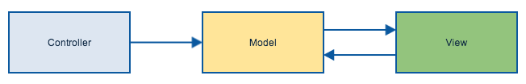
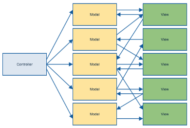
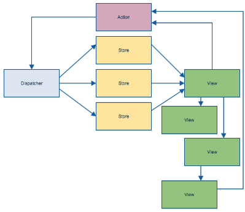
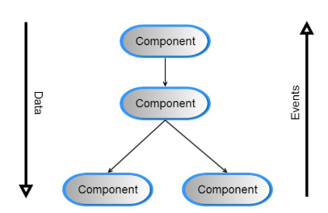

# React | A JavaScript library for building user interfaces


[React](http://facebook.github.io/react/index.html) is an open source library
from Facebook that aims to simplify how we write complex web applications in
JavaScript:

* Just the UI
* Virtual DOM
* One-way reactive data flow

The goal is to make it easier to write applications that perform well, are
easier to test, using reusable components.

## React in the wild

* [Instagram](http://instagram.com) - 100% of public and internal web development
* [Facebook](http://facebook.com) - commenting interface, business management
  tools, page insights, and more
* [Khan Academy](http://khanacademy.org) - most new development uses React
* [Atom](http://atom.io) - recently
  [switched to React](http://blog.atom.io/2014/07/22/default-to-react-editor.html)
  to implement their editor component

## UIs are hard

HTML5 is the modern runtime for creating cross-platform applications.

* Browsers are stateful
* Events and asynchronous behavior are hard to reason about
* Testing is complicated and error prone

## M[@!#]C!

Most alternative libraries are provide some variant of MVC (*Model, View,
Controller*) to separate concerns in an application.

The basic ideas seem straightforward at first:



But as an application grows, complexity can increase dramatically:



The untyped, dynamic nature of JavaScript can encourage these problems.

## Functional UI Programming

> What if we could just throw away the UI and rebuild it from scratch whenever
> something changes?

React (and the complementary [flux](http://fluxxor.com/what-is-flux.html)
architecture) imposes a *unidirectional* data flow that models views as simple
transforms of their corresponding state.



React provides *virtual DOM* which allows this to happen in a performant way.

## Data binding

Data binding exposes internal application information to the user, and
coordinates user input to mutate the state appropriately.

*Two-way* data bindings are one strategy to synchronize internal state and
the user interface:

* The binding renders the UI initially according to the the internal state
* Events are handled to change the internal state and make the corresponding
  interface change

## Comparisons

[jQuery](http://jquery.com/) is the founding father of JavaScript libraries,
but is not really suited for creating complex applications on its own.

* Primary use of normalizing across browsers is less important
* Manual event bindings are error-prone and create memory leaks
* DOM manipulation is cumbersome

## Comparisons

[Angular](https://angularjs.org/) uses *dirty checking* to provide two-way
bindings, and [Ember](http://emberjs.com/) and
[Knockout](http://knockoutjs.com/) use property observers.

All three of these are more full-featured than React in the sense that they
provide additional components for writing an application (models, controllers,
services, etc).

There are projects for each of these libraries to support moving interface
code to React using these backends.

## Using React

React has no dependencies, so you can begin using it simply by including the
associated script:

`<script src="lib/react.js"></script>`

There are also several starter projects that provide skeletons for basic apps:

* [React Starter Template](https://github.com/johnthethird/react-starter-template)
* [React Browserify Template](https://github.com/petehunt/react-browserify-template)
* [Yeoman](http://yeoman.io/) generators:
  [React](https://github.com/nemophrost/generator-react),
  [React + WebPack](https://github.com/newtriks/generator-react-webpack),
  [React + Gulp + Browserify](https://github.com/randylien/generator-react-gulp-browserify)

## JSX

React provides JSX, an *optional* HTML-like language, to define components:

```jsx
var HelloWorld = React.createClass({
  render: function() {
    return (
      <div className="hello">
        <p>Hello, { this.props.name }!</p>
      </div>
      );
  }
});
```

This is contrast to using templates or other non-JavaScript languages to define
user interfaces.

## JSX

JSX is simply a JavaScript preprocessor (like CoffeeScript or TypeScript), so
there are a couple of choices for writing code in React:

* Use JSX and a server-side build task (a browser-based processor is available,
  but not recommmended for production use)
* Use plain JavaScript

```javascript
var HelloWorld = React.createClass({
  render: function() {
    return React.DOM.div({className: "hello"},
        React.DOM.p(null, "Hello, ", this.props.name)
      );
  }
});
```

* Use an alt-JS language

```coffee
{ div, p } = React.DOM
HelloWorld = React.createClass
  render: ->
    div className: 'hello',
      p null, "Hello, #{@props.name}"
```

## Components

Components are the main unit of composition in React (that's actually pretty
much the entire API). You can think of components as your own HTML elements
that represent the display and behavior of the element in a HTML document.

A React application is a tree of components that passes state from the top
of the application down.



## Application State

A React application must model 100% of the state of the application at any given
moment - the UI is simply the result of transforming that state into the virual
DOM.

Within a component, application state is split into two properties

* `props` - Represents static values that are passed from the parent component
* `state` - Stores internal implementation details for the component

Ideally, most components will be *stateless* and thus simply transform the
`props` collection into a UI representation. `state` should be consolidated
into a few top-level components to simplify the overall design.

## Event handling

Event handlers are typically passed to child components through the `props`
collection as callbacks. React uses event delegation at the root element to
minimize the number of JavaScript event handlers that are registered.

```coffee
CountButton = React.createClass
  render: ->
    button onClick: @props.increment, "Count: #{@props.count}"

count = 1
incrementCount = ->
  count++
  button.setProps { count }


button = CountButton { count, increment: incrementCount }
React.renderComponent button, document.querySelector '#app'
```

## Server side

## Exercises left to the programmer...
